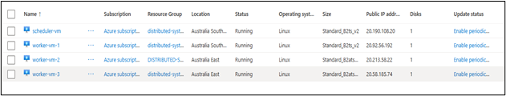
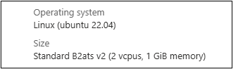
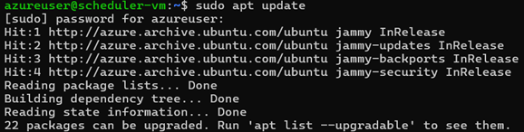
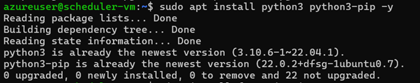
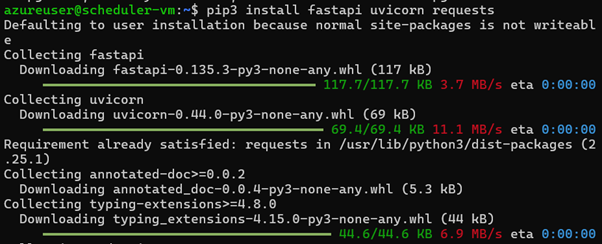
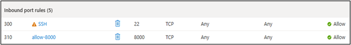
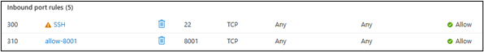
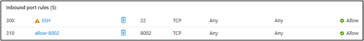
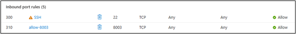

# cquict-coit20265-Network-and-information-Security

## 📸 Azure Screenshots

### 🔹 Resource Groups Overview

### 🔹 Azure VM Cluster (Scheduler + Workers)

### 🔹 VM Configuration (OS & Size)

### 🔹 VM Setup (Package Update)

### 🔹 Python Setup on VM

### 🔹 Backend Setup (FastAPI & Dependencies)

### 🔹 Network Security (NSG Rules)

#### Port 8000

#### Port 8001

#### Port 8002

#### Port 8003

