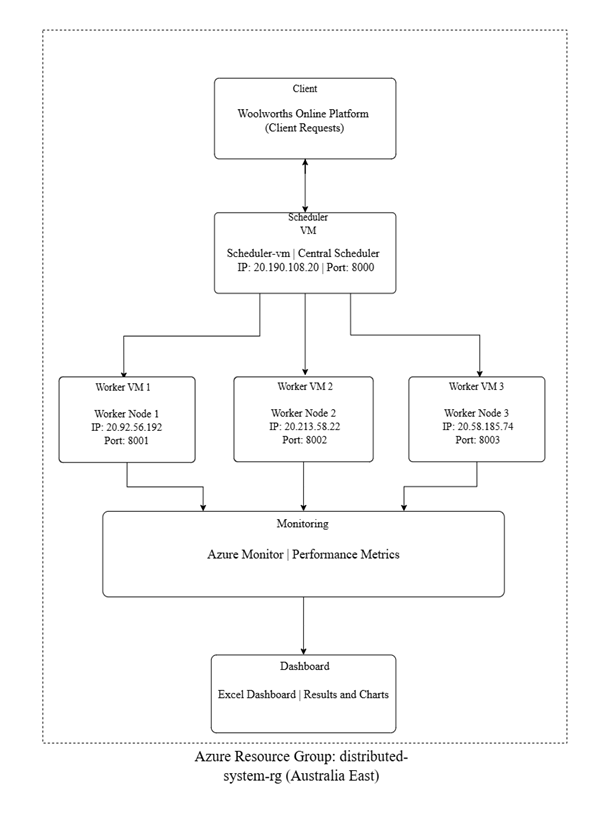
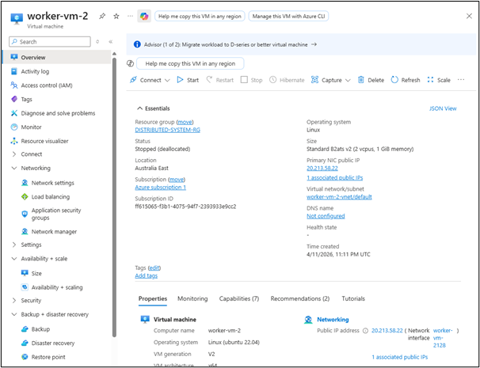
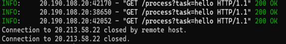
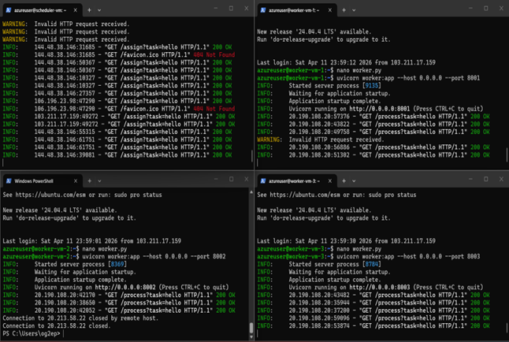
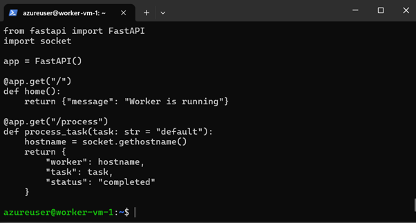
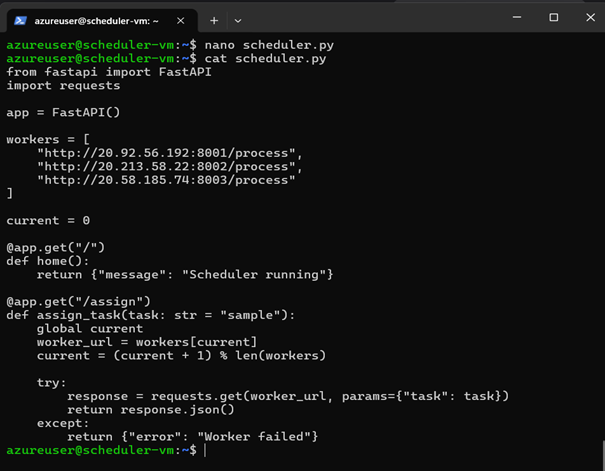
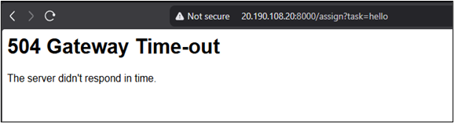

# cquict-coit20265-Network-and-information-Security

## 📸 Azure Screenshots

## 🏗️ System Architecture

### 🔹 Resource Groups Overview

### 🔹 Azure VM Cluster (Scheduler + Workers)

### 🔹 VM Configuration (OS & Size)

### 🔹 VM Setup (Package Update)

### 🔹 Python Setup on VM

### 🔹 Backend Setup (FastAPI & Dependencies)

### 🔹 Network Security (NSG Rules)

#### Port 8000

#### Port 8001

#### Port 8002

#### Port 8003

### 🔹 Node Failure Simulation (Worker VM 2 Stopped)

### 🔹 Node Failure Handling (Runtime Logs)

### 🔹 Multi-Node Execution (Scheduler + Workers)

### 🔹 Worker Node Service (FastAPI)

### 🔹 Scheduler Logic (Load Balancing)

### 🔹 Failure Scenario (Gateway Timeout)

